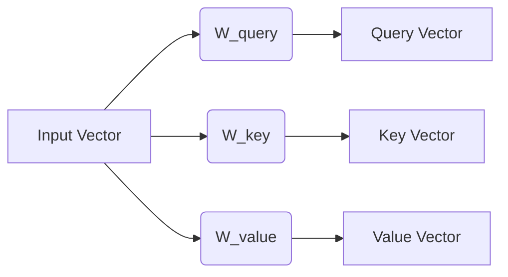

# Understanding the QKV (Query, Key, Value) Mechanism

The self-attention mechanism uses three distinct vectors for every token to calculate relationships. This document explains how they work together to produce the **Context Vector**.

## 1. The Analogy: A Library Search
Think of the attention mechanism like searching for information in a digital library:

*   **Query ($Q$):** The search term you type into the bar. ("What I'm looking for")
*   **Key ($K$):** The titles or tags of all the books on the shelf. ("What these tokens offer for matching")
*   **Value ($V$):** The actual content inside the books. ("The information I want to extract")

---

## 2. Step-by-Step Visualization

### Step 1: Projection
We start with the **Input Embedding** (Token + Position). We multiply it by three learned weight matrices ($W_Q, W_K, W_V$) to create three unique representations for each token.



### Step 2: Compatibility (The Dot Product)
To find out how relevant "Token A" is to "Token B", we take the **Query** of A and calculate the dot product with the **Key** of B. This produces a raw **Attention Score**.

*   **High Score:** The Query and Key are aligned (relevant).
*   **Low Score:** The Query and Key are perpendicular (irrelevant).

### Step 3: Scaling and Softmax (Normalization)
As discussed, we scale the scores by $1/\sqrt{d_k}$ and apply **Softmax**. This turns raw scores into a probability distribution (Weights) that sums to 1.

$$ \text{Weights} = \text{Softmax}\left(\frac{Q K^T}{\sqrt{d_k}}\right) $$

### Step 4: Aggregation (The Context Vector)
Finally, we use these weights to take a **weighted sum of the Values**. If a token has a high weight, its "Value" (information) will dominate the final output.

```text
Weights:    [ 0.1,   0.8,   0.1 ]  (I care mostly about the 2nd token)
              x      x      x
Values:     [ V1,    V2,    V3  ]
              |      |      |
              +------+------+
                     |
              [ Context Vector ]
```

---

## 3. Why separate Q, K, and V?

If we only used the original embedding for everything, the model would be rigid. By having three separate vectors:
1.  **Q and K** can focus on **matching logic** (e.g., "I am a verb looking for a subject").
2.  **V** can focus on **content** (e.g., "The meaning of the word 'fox'").

This separation allows the model to learn that a word might "look" for one thing (Query) but "offer" something else (Key) to other words.

---

## 💡 Summary Table

| Vector | Question it Answers | Primary Role |
| :--- | :--- | :--- |
| **Query (Q)** | "What am I looking for?" | Acts as the **Active** seeker of information. |
| **Key (K)** | "What do I contain?" | Acts as the **Passive** label for matching. |
| **Value (V)** | "What information do I give?" | Acts as the **Content** being transmitted. |
| **Context Vector** | "What did I learn from others?" | The final, **context-aware** representation. |
